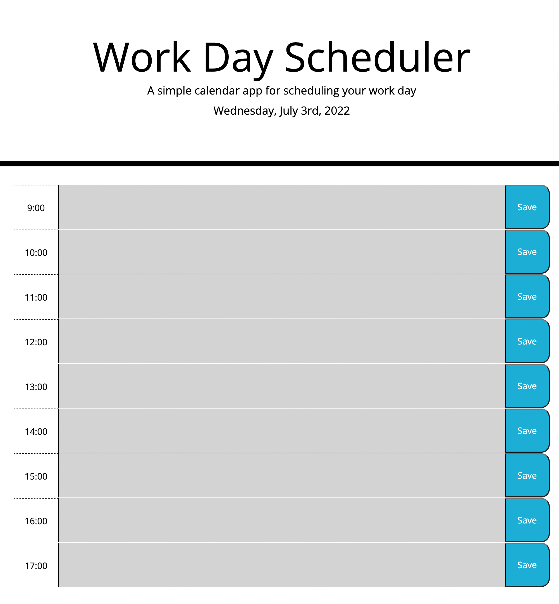

# JS_Day_Planner

A day planner web-application built with Javascript.

I was only able to get this application half-functional because I'm in the middle of moving and haven't had much time to work on it over the last week. Not an excuse, just submitting what I have done at this point.

I was successfully able to render the current time to the page header and create time block elements that users can type into. Using the pre-written style classes in the provided CSS file, I was able to successfully implement custom styling to each time block depending on the time of day. Unfortunately at the time of writing this, the attached preview image doesn't show the applied stylings, but I promise it actually works.

This all considered, I was only able to pseudocode the second half of this assignment, which is saving the user input data to the browser's local storage. I personally need some review on this topic but am doing my best to stay up to date as a person new to web development concepts.

A link to the semi-functional web-app can be found [here](https://cplancich.github.io/JS_Day_Planner/)

